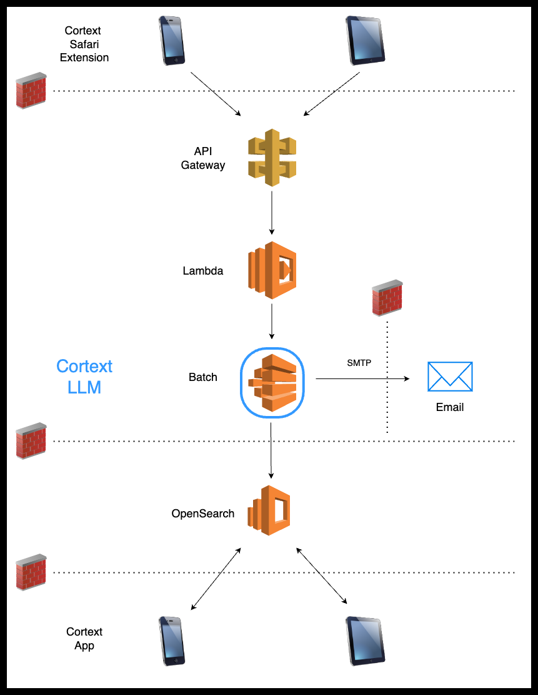

# [Cortext.io](https://cortext.io)

## Mission of the Project
Preserve Indigenous Languages 

by
expanding Cortext to 20 other languages
influencing "schema.org" to implement this **Semantic Calculus** across the web

## In Short
Powerful LLMs are held by IBM, Google, Twitter, ChatGPT ...

These companies provide consultations on how to ***engineer language*** to best accomplish sophist goals.
Cortext is a lightweight LLM that extracts "hashtags" and searches the most overlapping "Blue Words" in Wikipedia.

The Cortext LLM is more elegant than "Word2Vec" style Natural Language Processing, though crudely implemented... it is based on Wierzbicka's [Semantic Primes](https://en.wikipedia.org/wiki/Natural_semantic_metalanguage), and has the potential to function in 20+ languages.

## Microservice Architecture I run Cortext LLM within

### Command to run with text already in input.txt:
`./text.sh [Title] [Email] [Email?]`

### Command to run in Batch Job:
`["/bin/bash","-c","echo '[This is clean text that will not have encoding issues in a linux command line, and is also ~7800 characters]' > /home/ec2-user/cortext_io/cortext_io_input/input.txt && rm /home/ec2-user/cortext_io/cortext_io_input/input2.txt && /home/ec2-user/cortext_io/10K_RiskFactors_PROCESS/1_CORTEXT_Run.sh [Title] [Email] ['Yes'/'No']"]`

***You will need to replace the emails, usernames, and passwords in the following locations for this to actually send out content:***

|     Purpose        |Location                         |
|----------------|-------------------------------|
|Send Email Report with SMTP|[cortext_io/10K_RiskFactors_PROCESS/sendEmail.py](cortext_io/10K_RiskFactors_PROCESS/sendEmail.py)            |
|Push content to your ElasticSearch instance          |[cortext_io/10K_RiskFactors_PROCESS/zzz_pushElastic.py](cortext_io/10K_RiskFactors_PROCESS/zzz_pushElastic.py)            |

## Cortext LLM uses an SQLite database file for staging
**I recommend you open the SQLite Database File in a tool like DBeaver to understand the data model**
or see the uml diagram here: https://www.cortext.io/how-it-works

|     Purpose        |Location                         |
|----------------|-------------------------------|
|Relational Data Structure for Text Decomposition | [cortext_io/cortext_io_db/cortext_io.db](cortext_io/cortext_io_db/cortext_io.db)           |

## Track the Java Routines --> Look for .item
The LLM has gone through multiple languages and architectures (not to say they got progressively better). I landed on Talend... Search for the routines to see where the hashtag extraction takes place.
|     Purpose        |Location                         |
|----------------|-------------------------------|
|"Scripts" in Talend Workflow | [cortext_io/AA_cortext_io_linux_0.1/AA_cortext_io_linux/items/integralmass/code/routines ](cortext_io/AA_cortext_io_linux_0.1/AA_cortext_io_linux/items/integralmass/code/routines)           |

 

## Perceptron to Clean the Noise
A Python Perceptron is used to clean the noise, based on hand-selection of the best hashtag extractions from 1000 actuarial articles.

## D3.js Associative Web Not Currently in Workflow
It is my current understanding that email bodies cannot have executable javascript, so the Associative Web (force-directed node graph) is just hanging there.

## Home Website
https://cortext.io

## Risk Wiki
### Cortext ran over risk factors of 100s of Annual Reports from Public Companies
https://riskrunners.com

## Semantic Calculus
### Foundational Mathematics
https://perrydime.com/Begin_With_The_End_In_Mind.pdf

## First Implementation
https://nlpbigdata.jeffersonrichards.com/

## About Me
https://jefferson.cloud
